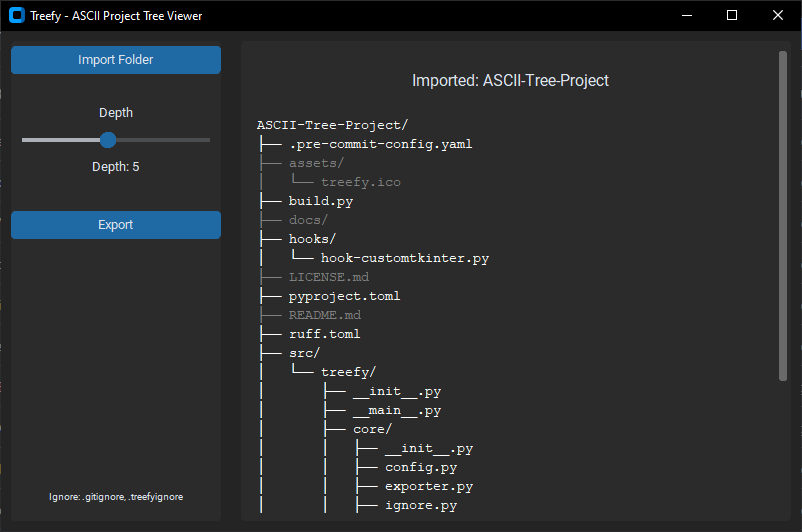

# Treefy – Project Tree Viewer

**Treefy** is a simple, intuitive Python app designed to visualize and export your project's folder structure in a clean, editable ASCII tree format. Ideal for documentation, codebase audits, or just getting a quick overview of a directory.

[**Download the latest release here**](https://github.com/cfrBernard/ASCII-Tree-Project/releases)


## Features:

- Import any project root folder.
- Automatically generates a `.treefy/` directory for internal utilities and cache.
- Honors your existing `.gitignore` file to exclude files/folders cleanly.
- Additional support for a custom `.treefyignore` fallback for finer control.
- Interactive GUI: select/deselect folders, control tree depth, and preview live.
- Export the final result to a `.txt` file in clean ASCII format.

---

<p align="center">
  
</p>

---

## 🛠 Development Setup

### Requirements:
- Python 3.11+

### Installation (Dev Mode):

```
git clone https://github.com/yourusername/Treefy.git
cd Treefy
```
```
pip install -e .
# or
pip install -e .[dev]
```

> Note: Using a .venv is highly recommended.

---

## Dev Tools


### Run the App:

```
python -m treefy
```

### Build the App:

```
python build.py
```

### Run pre-commit hooks:
```
pre-commit run --all-files
```

### Run tests:
```
pytest
```

---

## How to Use

Launch the app from the release executable or run it directly:

```
python -m treefy
```

- Import your root directory in the UI.
- Use the main view to select/deselect files or directories.
- Adjust depth to control how deep the tree goes.
- Export to .txt when you're ready.

> All app metadata and temp data are stored in .treefy/, isolated from your main project.

---

## 📁 Example Tree Output

```
ASCII-Tree-Project/
├── .pre-commit-config.yaml
├── assets/
│   └── treefy.ico
├── build.py
├── docs/
├── hooks/
│   └── hook-customtkinter.py
├── LICENSE.md
├── pyproject.toml
├── README.md
├── ruff.toml
├── src/
│   └── treefy/
│       ├── __init__.py
│       ├── __main__.py
│       ├── core/
│       │   ├── __init__.py
│       │   ├── config.py
│       │   ├── exporter.py
│       │   ├── ignore.py
│       │   ├── selection.py
│       │   ├── treebuilder.py
│       │   └── utils.py
│       └── gui/
│           ├── __init__.py
│           ├── app.py
│           ├── sidebar.py
│           └── treeview.py
└── tests/
    └── test_selection.py
```

> Here's an example of a generated tree

---

## 🔮 What's Coming: 

- More export formats: (JSON, Markdown, HTML).
- Improved UI/UX: Better tree manipulation and styling for v1.0.
- Minor bug fixes and stability improvements.

## 🤝 Contact:
For issues, suggestions, or contributions, feel free to open an issue on the GitHub repository.

---
> Made with 💚 during dungeon queues – This project is licensed under the MIT [LICENSE](./LICENSE.md).

